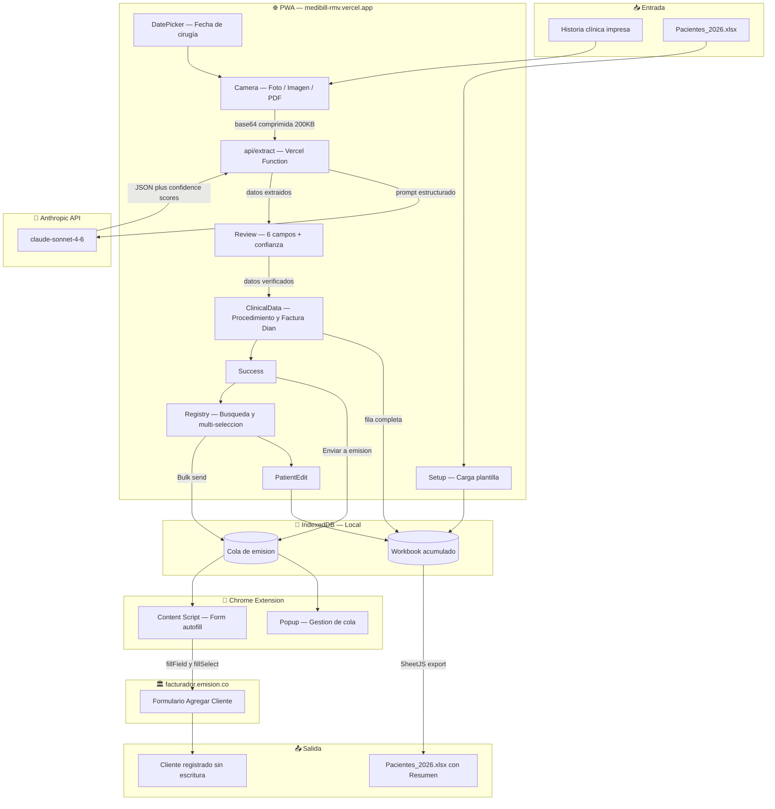

# MediBill RMV
### AI 201 Project 3 — Valeria Múnera | Spring 2026

**Live URL:** https://medibill-rmv.vercel.app
**Chrome Extension:** `/extension` folder — sideload in developer mode
**Design Research Compilation:** [`Design_Direction_Research_Compilation.md.pdf`](./Design_Direction_Research_Compilation.md.pdf)
**Marketing Minute:** [`public/Assignment3Ad.mp4`](./public/Assignment3Ad.mp4)
**AI Direction Log:** [`AI_DIRECTION_LOG.md`](./AI_DIRECTION_LOG.md)
**Records of Resistance:** [`RECORDS_OF_RESISTANCE.md`](./RECORDS_OF_RESISTANCE.md)

> A Progressive Web App + Chrome Extension that lets Dr. RM,
> an independent plastic surgeon in Colombia, photograph a patient's printed
> clinic history, extract billing data via AI vision, review and approve it,
> and have it automatically entered into the Colombian government's invoicing
> platform — eliminating the manual re-keying that previously consumed
> 45–60 minutes per month.

---

## Design Argument

**The person:** Dr. RM is a plastic surgeon practicing
independently in Medellín, Colombia. He is my father and someone I speak
with every day. He operates approximately 15 new patients per month,
primarily at IQ InterQuirófanos in El Poblado.

**The problem:**

The current electronic billing process forces independent medical professionals to 
manually re-enter patient information across disconnected systems, creating 
time-consuming administrative work. While my father still collects and stores 
accurate patient data through paper intake forms and spreadsheets, the lack of 
automation between these workflows and the e-Misión platform creates unnecessary 
wasted time that takes time away from patient care.

**What "helped" looks like:**

Success means completely erasing the administrative delays from his monthly 
routine, reducing a 45-to-60-minute task down to under 10 minutes. By automating 
data extraction directly from a photo into his existing Excel structure, he 
eliminates manual typing and no longer needs an intermediary to copy-paste data 
into emisión. Finally, success means that he can gain full independence in this 
process and will no longer need me to help him monthly, requiring less time and 
clicks. 

**Why I am the right person to build this:**

I am the only person who can build this because I have first-hand operational 
knowledge, specialized technical skill, and deep personal trust. As his daughter, I 
have daily access and an intimate understanding of his workflow, but more 
importantly, I am the one currently doing all of the manual process. Additionally, 
combined with my UX design background and AI production, I have the unique 
capability to translate this frustration into a high-fidelity solution. I speak his 
language, understand his handwriting, know the Colombian medical billing process, 
and hold a designer’s eye for his brand because I created it. Anyone else would 
just be building software, whereas I am building an extension of his daily practice 
that no outsider could replicate.

---

## Research Documentation

**Interview method:** Direct observation and daily conversation with my
father across multiple sessions. I have personal first-hand knowledge of
this workflow — I am currently the person who performs the manual
copy-paste step he needs to eliminate.

**Evidence gathered:**

| Evidence | What it shows |
|---|---|
| Pacientes_2026.xlsx (real file, de-identified) | His ledger structure — 17 columns, ~1010 pre-formatted rows, single continuous sheet "Hoja 1", no formulas, handcoded values throughout |
| 6 emisión screenshots (annotated) | The exact Agregar Cliente form I fill out, field by field, with default dropdown values and form field IDs confirmed via DOM inspection |
| DOM diagnostic output | console.querySelectorAll output showing exact HTML field IDs (client_name, client_document_number, client_organization_type, etc.) used to build the Chrome extension |
| His logo files (logo.ai, logo2.pdf) | Brand identity — navy #172137, white, uppercase geometric typography |
| His Instagram | Public professional identity and brand context |

**Direct observations from my father during supervised development and user 
testing:**
My dad was able to separate the two moments without needing instructions. This 
confirmed the decision to split the system was on the right track.

During testing, he hesitated when the extraction process originally took around 30 
seconds and commented that it felt too slow for something he would use repeatedly 
between patients. Once the processing time dropped to around 4–8 seconds, he became 
more comfortable continuing through the workflow.

When reviewing extracted patient data, he consistently checked ID numbers, patient 
names, and email first before looking at any other field. These are the most 
important categories in which the system must work with high accuracy. 

When I observed him process multiple patients, it was clear that he grouped billing 
into batches based on the month. This directly led me to the addition of the 
multi-select feature in the Registry view for faster emisión submission.

He showed frustration whenever a workflow required unnecessary repeated clicking or 
tab switching, especially when moving between the main spreadsheet and the emisión 
platform. This confirmed to me the idea that reducing interaction repetition was 
way more important to him than adding additional features or visual complexity.

He is not that tech savvy, meaning that this tool must be developed in the simplest 
way possible. 

When testing the Chrome extension, he reacted most positively to seeing the emisión 
fields fill out automatically in real time.

He consistently processed billing from a desktop computer even after successfully 
using the mobile capture flow. 

This observation confirmed that the desktop version is still essential because 
emisión itself is significantly easier to manage on a larger screen.

During feedback conversations, he focused far more on reliability and speed than 
aesthetics. His comments were usually about whether the system reduced 
administrative effort time, whether the data was accurate, or whether the process 
felt trustworthy enough for real patient data. 

**Key workarounds that revealed what was broken:**

- Me acting as a human copy-paste machine between his
  Excel spreadsheet and the government portal
- Manual Google searches to find what Colombian department a patient's
  city belongs to when only a partial address is on the form
- A paper-first patient intake process that already captures all the
  data the platform needs — it just lived in two disconnected systems

**Constraints that became design requirements:**

- Patient data is sensitive personal information under Colombian
  Ley 1581 / habeas data — no server-side storage
- He has no resolución vigente with DIAN yet — scope stops at
  Agregar Cliente, not invoice creation
- He uses his iPhone for clinical capture and his Mac for desk work —
  one surface cannot serve both contexts
- The tool must be in Spanish — he is the sole user

---

## Platform Rationale

**Two surfaces, not one. This was a deliberate architectural decision.**

The product is a Progressive Web App (PWA) deployed on Vercel plus a
Chrome extension sideloaded in developer mode on his Mac.

**Why a PWA, not a native iOS app:**
- Single codebase works on his iPhone 17 Pro Max, iPad, and MacBook
- No App Store review process — I control deployment
- "Add to Home Screen" gives him a real app icon without distribution friction
- React + Vite + Tailwind carries forward from the course stack

**Why a Chrome extension (sideloaded), not a web-based solution:**
- He is the only user — Chrome Web Store review (1-3 days) is unnecessary friction
- A content script running on facturador.emision.co can directly manipulate
  the form's DOM using confirmed HTML element IDs
- Browser extensions can fill dropdown menus programmatically — a
  clipboard-copy approach cannot (see Records of Resistance #1)
- Sideloading is standard practice for internal automation tools

**Why two surfaces, not one:**
Capture happens at the clinic during surgical hours — paper history in one
hand, iPhone in the other. Submission to emisión happens at his desk in
Chrome. An iPhone cannot run a Chrome extension. A desktop browser cannot
reasonably photograph a paper form. These are two genuinely different
contexts of use that require two genuinely different tools sharing one
local state via IndexedDB.

**Why local storage (IndexedDB), not a backend database:**
Patient medical data is sensitive under Colombian Ley 1581. Storing it on
any server we control creates legal exposure. At 15 patients/month, a
backend is also over-engineered. IndexedDB on the device is the correct
scope. Cross-device needs are handled by the Excel export/re-import flow.

---

## Mermaid Diagram — System Architecture

See [ARCHITECTURE.md](./ARCHITECTURE.md) for the full annotated diagram.



---

## AI Direction Log

See [AI_DIRECTION_LOG.md](./AI_DIRECTION_LOG.md) for all 12 documented entries.

*Generated by Claude AI per professor's explicit permission for this
documentation category. All directions reflect real decisions made
during build sessions, supervised by Dr. RM.*

---

## Records of Resistance

See [RECORDS_OF_RESISTANCE.md](./RECORDS_OF_RESISTANCE.md) for all 8 documented moments.

*Generated by Claude AI per professor's explicit permission for this
documentation category. All resistance moments reflect real decisions
made during build sessions under the direct supervision of
Dr. RM.*

---

## Five Questions Reflection

**1. Can I defend this?**
Yes, I can defend the decisions I made because almost every important feature came 
directly from something I observed in my father’s real workflow. The clearest 
example is the Chrome extension. At first, AI suggested a clipboard-based system 
where patient data would simply be copied from one place into another, but I 
immediately knew that would not actually solve the problem because I had personally 
been the person doing that copy-paste work for him for months. It would have been 
the exact same process with slightly different screens. Another strong example is 
the “Resumen” sheet. That was not added as a convenience feature, but my father 
explained that the monthly “Factura Dian” total is what he uses to calculate his 
Colombian seguridad social payments, including pension, salud, and ARL 
contributions. This is something that made the sheet financially and legally 
important. Smaller decisions also came from direct observation: I removed automatic 
date defaults because he often bills patients days or weeks after surgery, I kept 
the interface entirely in Spanish using Colombian medical billing terminology 
because he is the only user, and I chose local storage with no backend because 
patient information is protected under Colombian habeas data laws. Even the speed 
optimization came from testing with him directly: the original 30-second extraction 
time was simply too slow for clinical use, so I redesigned the pipeline until it 
reached around 4–8 seconds. Looking back, I think what I would improve is 
documenting these observations more formally earlier in the process instead of 
relying mostly on ongoing conversations and hands-on involvement.

**2. Is this mine?**
I believe this project is genuinely mine because the important decisions did not 
come from AI and they came from my understanding of my father’s life and workflow. 
The strongest example was when AI suggested a clipboard-based solution for 
transferring patient data into emisión. I rejected it almost immediately because I 
knew, from firsthand experience, that this was already the exact process we were 
trying to move away from. I had personally spent months switching between 
spreadsheets and the platform copying patient information field by field, so I knew 
that solution would not meaningfully reduce his workload. The same thing happened 
with the automatic date selection. AI assumed the “today” date would be correct 
because that is standard UX logic, but I overrode it because I knew my father 
usually photographs patient forms during surgery days and handles billing later. 
Another important moment was when AI assumed the Excel system used separate monthly 
sheets, but once I introduced the real spreadsheet, that assumption turned out to 
be wrong. I think this process taught me that directing AI is about constantly 
evaluating whether its suggestions actually match the reality of the person you are 
designing for. Finally, I had a clear role in filtering every decision through what 
I knew about my father’s real needs.

**3. Did I verify?**
Yes, the project was verified continuously throughout development because my father 
was actively involved in shaping the system as it was being built. I did not 
disappear for weeks and then showed him a finished prototype at the end. Instead, 
he regularly supervised decisions through conversations, testing sessions, and 
feedback while I was developing the tool through phone calls. He watched his actual 
Pacientes_2026.xlsx file load correctly into the app with patient information, 
confirmed that the extraction speed became acceptable once it reached around 4–8 
seconds, and directly requested features like multi-select after realizing he often 
processes patients in batches for emisión submission. He also watched the Chrome 
extension fill the real “Agregar Cliente” form on the emisión platform using his 
patients’ data, which was one of the clearest moments of validation in the project. 
Another important piece of feedback came when he identified the need to capture 
clinical information like Procedimiento and Factura Dian during the same workflow 
as the patient photo. I think one thing I could improve in the future would be 
creating a more formal testing structure with documented task observations instead 
of relying mostly on ongoing collaborative feedback. Still, I honestly think his 
continuous involvement made the verification process stronger because the tool 
evolved directly around his daily routine instead of being evaluated only after 
completion.

**4. Would I teach this?**
Yes, I think I understand this project well enough to explain and teach the main 
architectural decisions behind it. I can clearly explain why the system became a 
two-surface architecture instead of a single app: my father’s workflow naturally 
happens across two contexts. Patient intake and photo capture happen quickly at the 
clinic on mobile, while billing happens later at a desktop computer inside emisión. 
Trying to force both tasks into one interface would have created new forms of 
friction. I can also explain the extraction pipeline in detail, how the images are 
compressed client-side before being sent to a Vercel serverless function connected 
to the Anthropic API, and how the extracted patient information is returned as 
structured JSON with confidence scoring. I understand the privacy reasoning behind 
keeping the API key in environment variables and using local storage instead of 
maintaining a backend database with sensitive patient information. I also 
understand the logic behind the Excel export system and the Chrome extension’s 
DOM-based autofill process. At the same time, there are still some technical areas 
where I would probably need notes before teaching them confidently, especially 
lower-level implementation details like certain SheetJS syntax or IndexedDB 
structures. I think I understand the system very strongly from a product design and 
systems-thinking perspective, even if there are engineering details I am still 
learning more deeply.

**5. Is my disclosure honest?**
Yes, I believe my disclosure is honest because the AI Direction Log and Records of 
Resistance describe real events that happened during development. Some of the 
strongest moments in the documentation came directly from real conversations and 
real frustrations I experienced while helping my father with billing. The 
documentation itself was generated with AI, which my professor explicitly allowed, 
but the decisions, resistance moments, and workflow observations it describes are 
genuine. My father supervised the entire project throughout development, and many 
of the final features exist because of his direct feedback. I also think it is 
important to be honest about the fact that the process was sometimes messier and 
less linear than the logs make it appear. Many decisions changed through testing 
and conversation. Still, I stand behind the overall picture the logs present 
because they accurately reflect the relationship between myself, the AI tools, and 
my father’s real workflow. More than anything, this project was about using AI to 
help build something specifically around one person’s everyday reality.

---

## Post-Mortem

The development of MediBill RMV, showed me how important it is to design around 
real-life workflows instead of relying on generic AI assumptions. Throughout the 
process, the AI kept suggesting common SaaS and mobile app patterns, however, many 
of these ideas did not actually fit the way the clinic operates day to day and the 
workflow of what my dad has to complete.

Because I understood the workflow firsthand, the project finally transformed into a 
dual-system solution: a mobile PWA for taking photos of patient forms at the clinic 
and a Chrome extension that automatically fills patient data into the emisión 
platform on desktop, matching Dr. M’s actual routine of working across multiple 
devices. The extraction pipeline was also heavily optimized, reducing processing 
time from around 30 seconds to just 4–8 seconds through image compression and a 
lighter AI model. Even the Excel structure was redesigned around Colombian 
administrative realities, especially the “Resumen” sheet used to calculate monthly 
seguridad social payments. In the end, the project showed me that building 
effective AI tools requires a deep understanding of the user’s environment and real 
operational constraints.

---

## Setup — How to Run

### PWA
The app is live at https://medibill-rmv.vercel.app — no local setup needed.

For local development:
```bash
npm install
npm run dev
```

Environment variable required (set in Vercel dashboard):
```
ANTHROPIC_API_KEY=sk-ant-...
```

### Chrome Extension
1. Clone this repo
2. Open Chrome → `chrome://extensions`
3. Enable Developer mode (top right)
4. Click "Load unpacked"
5. Select the `/extension` folder
6. Note the Extension ID shown
7. Update `EXTENSION_ID` constant in `src/screens/Success.jsx`

### First-time app setup
1. Open the PWA
2. Upload `Pacientes_2026.xlsx` (or your equivalent template)
3. The app stores it locally — you only do this once

---

*MediBill RMV — AI 201 Project 3 | Spring 2026*
*Built for Dr. RM, Cirujano Plástico, Medellín Colombia*
